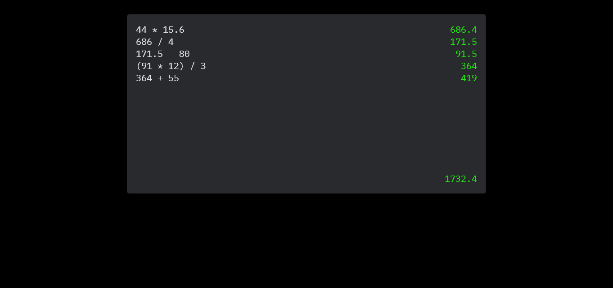

<h1 align="center">Web Calculator</h1>


> <i>Status: finished</i> ✔

## 📝 Description

<p>Front-end project of a calculator website, inspired by Numi app, built with HTML, CSS and Typescript.</p>

✌ [Click here to see the demo](https://celiovjunior.github.io/ts-calc/) ✌

---

## 🧲 Donwload

<p>Before download the project, make sure you have Node.js and Git installed in your machine.</p>
<p>Also, the commands below were ran in a git bash terminal.</p>

```bash
# cloning the repository
$ git clone git@github.com:celiovjunior/typescript-calc.git

# enter the folder
$ cd typescript-calc

# open the document
$ explorer.exe
```

> <i>If you want to change and test some features in this project, you can use your favorite IDE or Text Editor. I made this project using VS Code. </i>

---

## ✨ Final

<p>If you are dealing with some issues, bugs or have any question about this project, contact me:</p>
📩 cl.juniorr@gmail.com
